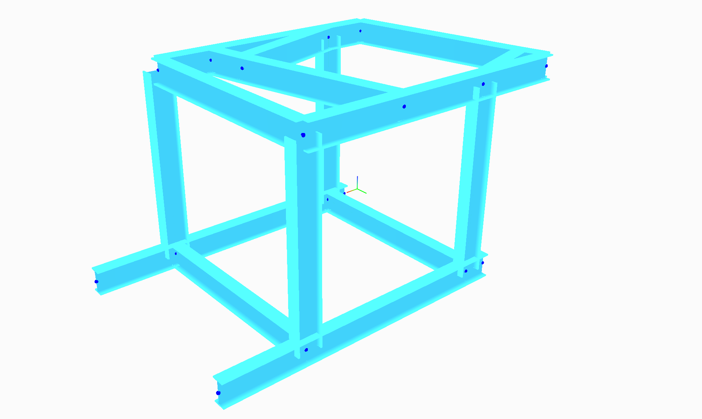
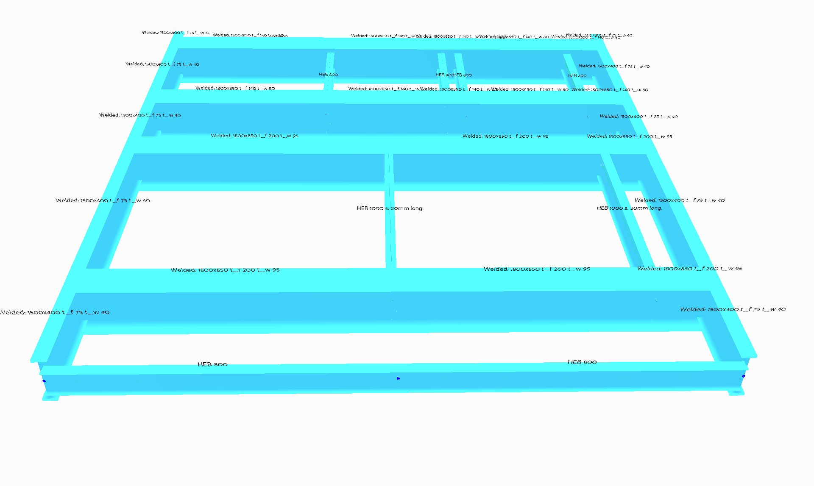
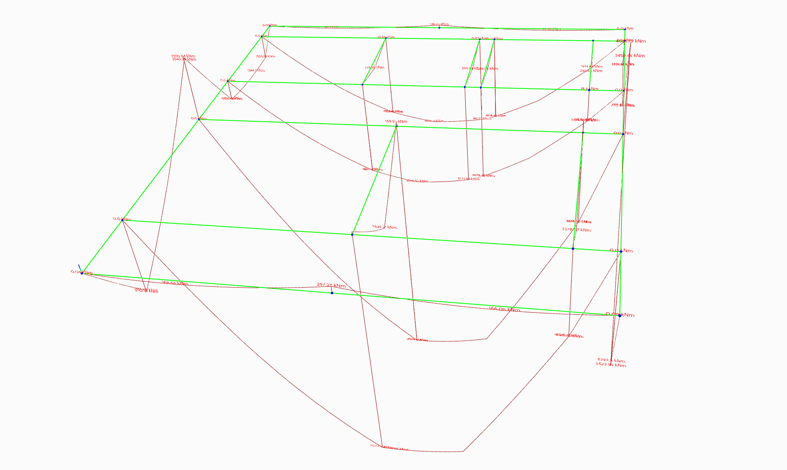

edsFEM

edsFEM is an open source, simple, 3d, frame analysis software package.
It is usable by setting up a structural model, including beams, supports and loads in a script.
Using the script it is possible to render model geometry and results of the analysis in a gui.

Examples of these scripts are found in the [examples](examples/) folder.

|3d Model floor system| Moment lines output|
|---|---|
|||

To use edsFEM, you need to have the Python programming language installed, along with the following packages;
numpy
scipy

To be able to use the renderer, you need the following additional packages;
panda3d
PIL
