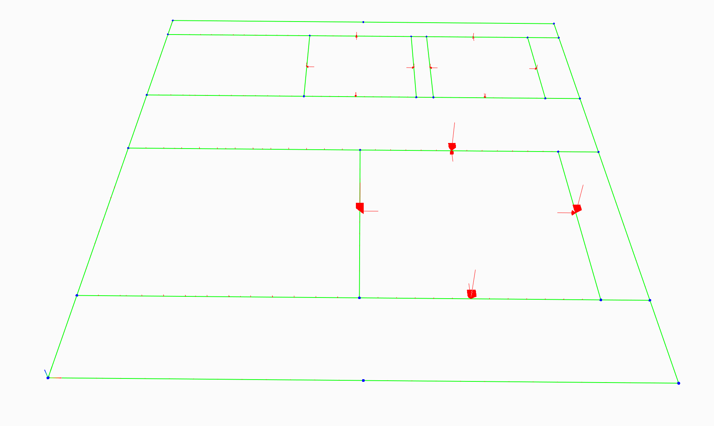
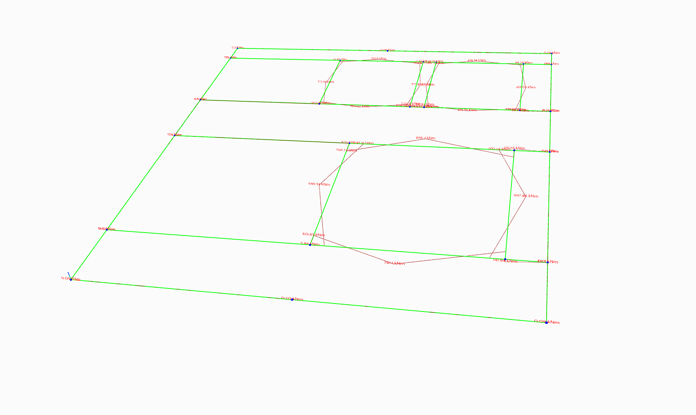
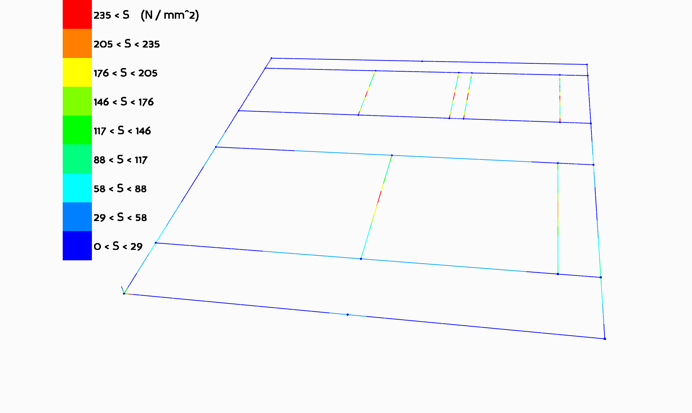
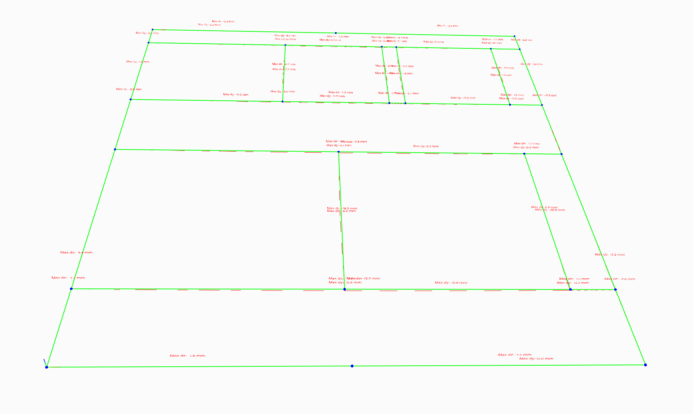

## edsFEM

edsFEM is an open source, simple, 3d, frame analysis software package.

It is usable by setting up a structural model, including beams, supports and loads in a script.

Using these scripts it is possible to render model geometry and results of the analysis in a simple gui.

Examples of these scripts are found in the [examples](examples/) folder.

|3d Model industrial floor system| Loading |
|---|---|
|||
|Moment lines about local y| Moment lines about local z|
|||
|Normal stresses output| Displacement output |
|||

To use edsFEM, you need to have the Python programming language installed.

To be able to use edsFEM to its full extents, you need the additional packages listed here;

|Functionality|packages|
|---|---|
|edsFEM|numpy|
||scipy|
|Renderer|panda3d|
||PIL|
